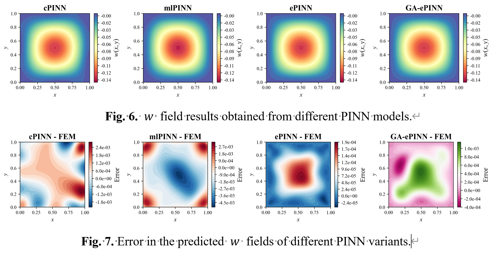

**A Geometry-Aware Energy-based PINN for Geometric Parametric Modeling in Computational Mechanics**

**Abstract:** Existing Physics-Informed Neural Network (PINN) frameworks are geometry-specific, necessitating costly retraining for any alteration in the structural geometry. This study incorporates a structure's geometric parameters as inputs to the model. Trained only once, it can solve for the deformation of any geometric configuration within a parametric domain. We term this framework the Geometry-Aware energy-based Physics-Informed Neural Network (GA-ePINN) and validate it through a series of numerical experiments on the Kirchhoff Plate problem. Results show that in an aspect ratio parameterization case, the GA-ePINN achieves a computational efficiency more than 10 times greater than the Finite Element Method (FEM), while maintaining an average deflection error below 1%. In high-dimensional parameterization cases involving internal boundaries, the average deflection error is also kept within 3%. This approach leverages the intrinsic advantages of mesh-free methods, showing significant potential for high-dimensional problems. 

  

  

  

  

  

